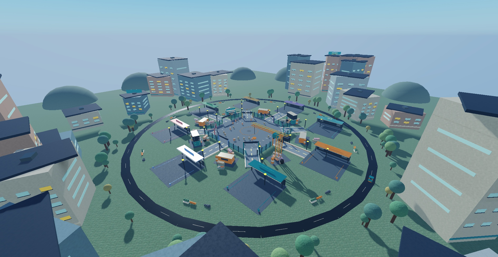

# Roblox-Game

Junkyard Fusion: collect scrap, combine builds and grow your own workshop.

The Foundry District refresh adds colorful garages, a crane, shipping containers, a detailed skyline and moving workshop machinery.

- [Latest handoff for Claude](HANDOFF.md)
- [Map reconstruction, verification and limitations](docs/map-refresh.md)
- [Backup status](BACKUP.md)

Scripts are arranged under src by their Roblox Studio service. The Rojo project configuration imports the twelve scripts; MapBootstrap can recreate the authored map from MapBaseline and MapRevamp on Play. A native place export remains useful for additional settings. Existing Studio content is preserved by the sync configuration.

Gamepass IDs are not configured yet. No recent changes have been published to Roblox.
